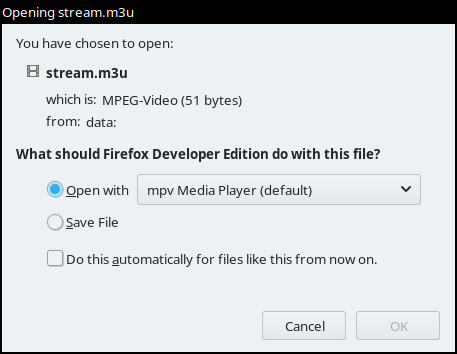

# open-with

A simple WebExtension to play back media in an external player.

## Compatibilty

*open-with* was originally intended to use [mpv] via the [youtube-dl] hook for a long list of [supported sites]. However, it will also work with other media players with [M3U] support, e.g. VLC, for direct media URLs.

## About

There have been addons on [AMO] prior to the release of *open-with*, but they depend on [native-messaging]. This WebExtension is designed to work on its own, without the need to install native messaging software on the host.

This is achieved by creating a plain text file with the M3U header, paste the current link into it and open the downloaded M3U playlist in your preferred media player.

## Credits

This project is licensed under the [GPL]. The used [icon] is from Mozilla's [Photon] collection and licensed under the [MPL].

<!-- References -->
[AMO]: https://addons.mozilla.org/
[GPL]: COPYING
[icon]: src/icons/play-16.svg
[m3u]: https://en.wikipedia.org/wiki/M3U
[MPL]: https://www.mozilla.org/en-US/MPL/2.0/
[mpv]: https://mpv.io/
[native-messaging]: https://developer.mozilla.org/en-US/Add-ons/WebExtensions/Native_messaging
[Photon]: https://design.firefox.com/icons/viewer/#play
[supported sites]: https://rg3.github.io/youtube-dl/supportedsites.html
[youtube-dl]: https://youtube-dl.org/

